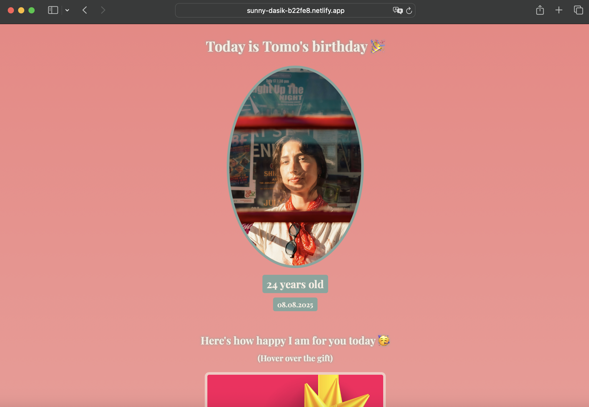

# Birthday GIFt Site 👀

A playful and heartfelt one-page site dedicated to celebrating "Tomo’s" birthday — full of surprises, interactive GIFs, and heartfelt messages.

##  🥳 Features
- **Bold Headline** announcing "Today is Tomo's birthday" with immersive styling
- **Age Reveal**: “24 years old” displayed prominently with the birth date “08.08.2025”
- **Interactive Elements**: Hover effects for hidden messages like "How happy I am for you today" and "If I had to describe you with ONE word"
- **Animated Delight**: Surprise GIF that pops up upon hover—perfect for a personal touch
- **Light & Joyful Design** that conveys celebration and warmth

##  🖖 Live Demo
[Check It Out](https://sunny-dasik-b22fe8.netlify.app/)

##  👀 Preview


```bash
#  Getting Started
#Simply clone the repo and open the HTML file in your browser—no setup required:

git clone https://github.com/yourusername/birthday-gift-site.git
cd birthday-gift-site
open index.html  # Or double-click to launch in your browser
```
